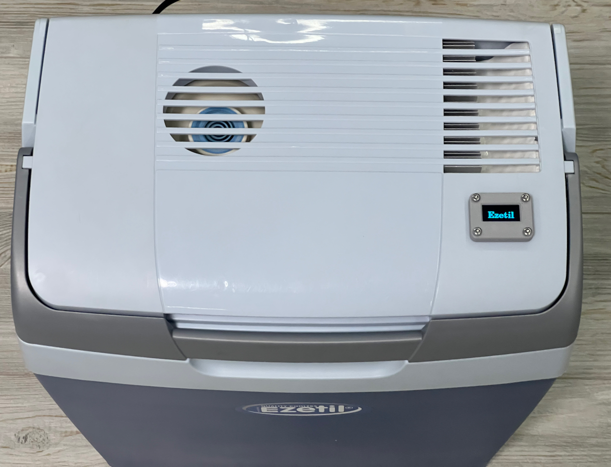
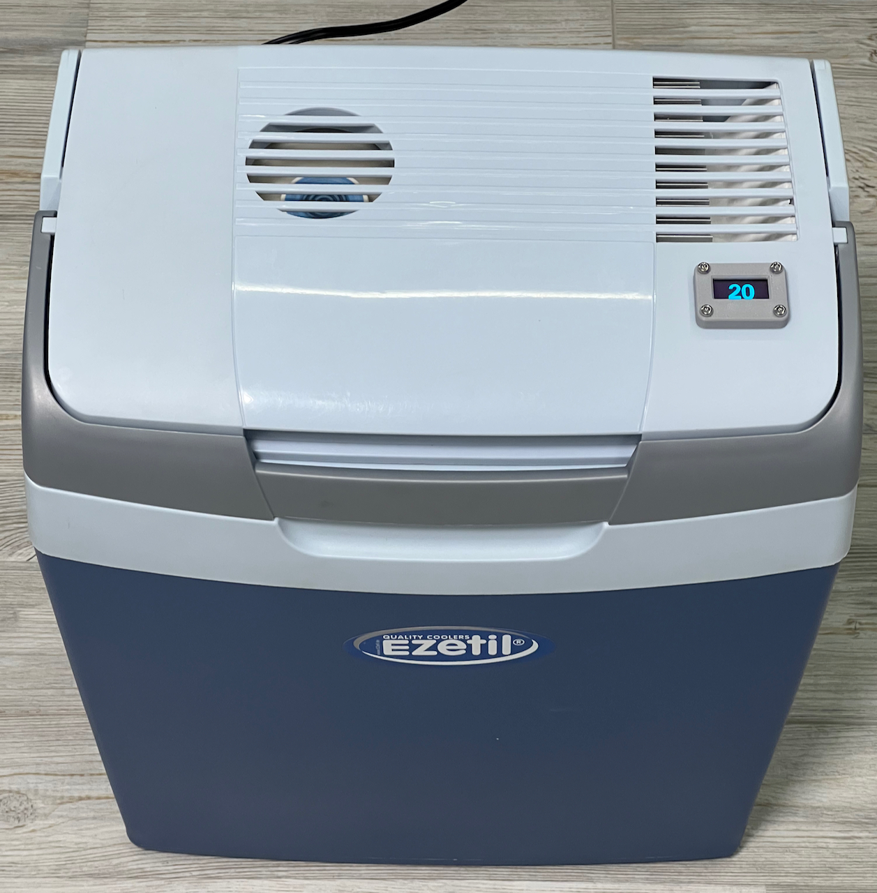
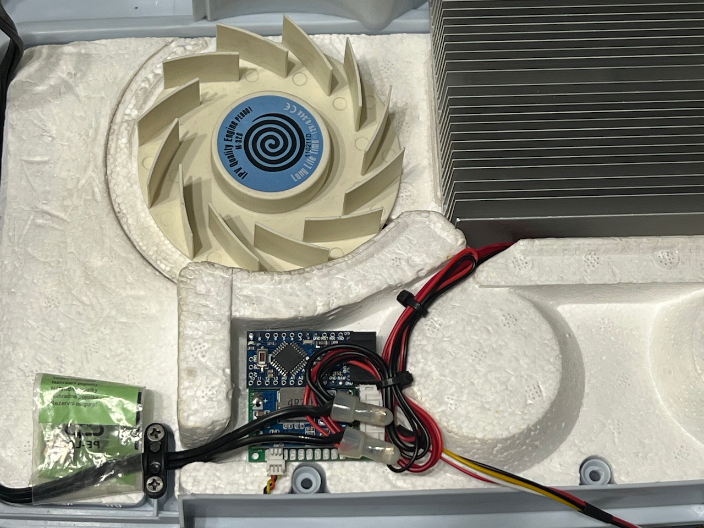

# CarFridgeTempIndicator
Temperature indication on the car refrigerator

## Required parts
* DC-DC Converter 36V to 3.3V
* Arduino Pro Mini 3.3V
* Temperature sensor DS18B20
* OLED display SSD1306 0.96 inch
* Pull-up resistor 4.7 kOhm

